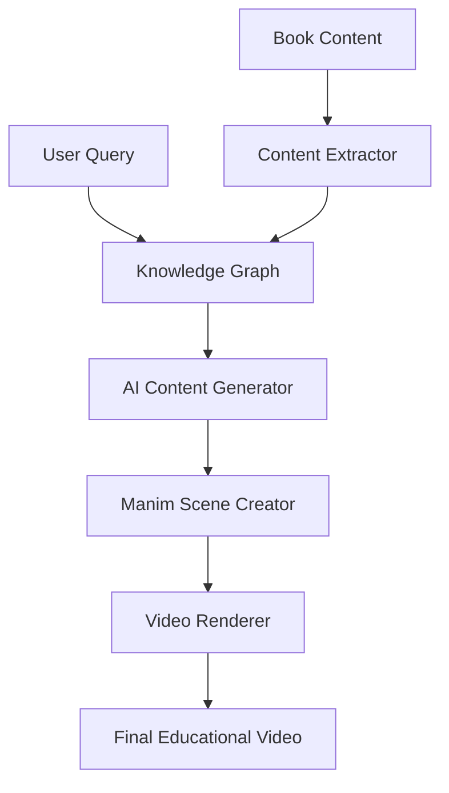

# AI_AyushBorse
# AI-Powered Knowledge Graph to Manim Animation Automation 🎬🧠

Transform educational content into engaging animated videos automatically using AI and mathematical animations.

[](https://www.python.org/downloads/)
[](https://opensource.org/licenses/MIT)
[](https://github.com/psf/black)

## 🚀 Features

- **Intelligent Knowledge Extraction**: Build comprehensive knowledge graphs from educational content
- **AI-Powered Content Generation**: Generate structured slides and scripts using advanced LLMs
- **Automated Manim Animations**: Create stunning mathematical and algorithmic visualizations
- **Multi-Domain Support**: Specialized modules for DSA, GIS, Space Technology, and more
- **Scalable Architecture**: Handle large content libraries and concurrent video generation
- **RESTful API**: Easy integration with existing educational platforms

## 🏗️ Architecture



## 🛠️ Quick Start

### Prerequisites

- Python 3.8+
- Neo4j Database
- FFmpeg
- OpenAI API Key (or other LLM provider)

### Installation

1. **Clone the repository**
```bash
git clone https://github.com/yourusername/ai-manim-education.git
cd ai-manim-education
```

2. **Create virtual environment**
```bash
python -m venv venv
source venv/bin/activate  # On Windows: venv\Scripts\activate
```

3. **Install dependencies**
```bash
pip install -r requirements.txt
```

4. **Setup environment variables**
```bash
cp .env.example .env
# Edit .env with your configuration
```

5. **Initialize the database**
```bash
python scripts/setup_database.py
```

6. **Start the application**
```bash
python -m src.api.main
```

## 🎯 Usage Examples

### Generate a Video via API

```python
import requests

response = requests.post("http://localhost:8000/generate-video", json={
    "query": "binary search algorithm",
    "domain": "DSA",
    "duration": 300,
    "difficulty_level": "intermediate"
})

video_info = response.json()
print(f"Video generated: {video_info['video_url']}")
```

### Direct Python Usage

```python
from src.orchestrator.pipeline import VideoGenerationOrchestrator

orchestrator = VideoGenerationOrchestrator()

result = await orchestrator.generate_educational_video(
    query="merge sort algorithm",
    domain="DSA",
    video_length=240
)

print(f"Video saved to: {result['video_path']}")
```

## 📚 Documentation

- [Architecture Overview](docs/architecture.md)
- [Setup Guide](docs/setup_guide.md)
- [API Reference](docs/api_reference.md)
- [Examples](docs/examples/)

## 🧪 Testing

```bash
# Run all tests
pytest

# Run specific test suite
pytest tests/test_knowledge_graph/

# Run with coverage
pytest --cov=src tests/
```

## 🐳 Docker Deployment

```bash
# Build and run with Docker Compose
docker-compose up --build

# Access the API at http://localhost:8000
```

## 🤝 Contributing

1. Fork the repository
2. Create your feature branch (`git checkout -b feature/amazing-feature`)
3. Commit your changes (`git commit -m 'Add amazing feature'`)
4. Push to the branch (`git push origin feature/amazing-feature`)
5. Open a Pull Request

## 📄 License

This project is licensed under the MIT License - see the [LICENSE](LICENSE) file for details.

## 🙏 Acknowledgments

- [Manim Community](https://www.manim.community/) for the amazing animation library
- [Neo4j](https://neo4j.com/) for graph database capabilities
- OpenAI for powerful language models

## 📞 Support

- 📧 Email: ayushborse40@gmail.com
```
